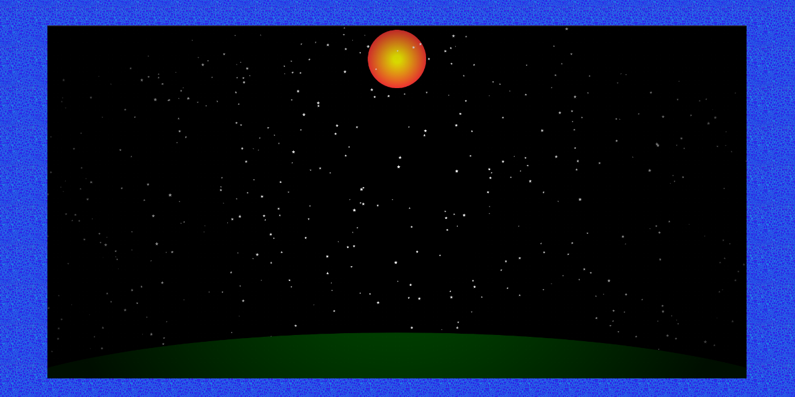

# Canvas Sky Animation

## General info
The purpose of the project is expand a programming knowledge in JavaScript.

## Setup
* `git clone https://github.com/krylak123/canvas-sky-animation.git`
* `npm install`
* `npm start`

## Screenshots

## Technologies
* OOP
* SCSS
* Webpack 5

## Features
* moving stars

## Status
Project is _in progress_
